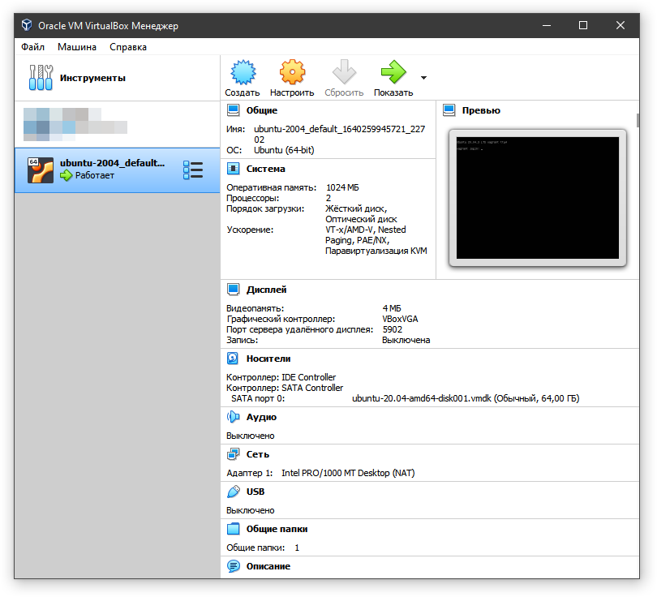

# Домашнее задание к занятию "3.1. Работа в терминале, лекция 1"

1-5. VirtualBox с установленной и запущенной через Vagrant Ubuntu 20.04:



По умолчанию для машины с Ubuntu VirtualBox выделяет 1024 МБ памяти и виртуальный диск на 10 ГБ. Поскольку в данном случае машина разворачивалась из бокса Vagrant, диск у нее 64 ГБ и в формате vmdk, а не vdi, как было бы по умолчанию. Есть ряд других отличий от машины по умолчанию: отключен звук, USB, два виртуальных процессора вместо одного, отличия в конфигурации дисплея, настроена общая папка (для vagrant) и некоторые другие мелочи.

Добавить машине оперативной памяти или процессоров можно через интерфейс VirtualBox, или указав в Vagrantfile другое значение для провайдера, например:

    config.vm.provider "virtualbox" do |vb|
       vb.memory = 2048
       vb.cpus = 3
    end

Проверим.

``` shell
$ /c/HashiCorp/Vagrant/bin/vagrant.exe up
Bringing machine 'default' up with 'virtualbox' provider...
==> default: Checking if box 'bento/ubuntu-20.04' version '202112.19.0' is up to date...
==> default: Clearing any previously set forwarded ports...
==> default: Clearing any previously set network interfaces...
==> default: Preparing network interfaces based on configuration...
default: Adapter 1: nat
==> default: Forwarding ports...
default: 22 (guest) => 2222 (host) (adapter 1)
==> default: Running 'pre-boot' VM customizations...
==> default: Booting VM...
==> default: Waiting for machine to boot. This may take a few minutes...
default: SSH address: 127.0.0.1:2222
default: SSH username: vagrant
default: SSH auth method: private key
default: Warning: Connection aborted. Retrying...
default: Warning: Remote connection disconnect. Retrying...
default: Warning: Connection reset. Retrying...
==> default: Machine booted and ready!
==> default: Checking for guest additions in VM...
==> default: Mounting shared folders...
default: /vagrant => C:/Users/ivg/Documents/Devops/ubuntu-20.04
==> default: Machine already provisioned. Run `vagrant provision` or use the `--provision`
==> default: flag to force provisioning. Provisioners marked to run always will still run.

$ /c/HashiCorp/Vagrant/bin/vagrant.exe ssh
Welcome to Ubuntu 20.04.3 LTS (GNU/Linux 5.4.0-91-generic x86_64)

 * Documentation:  https://help.ubuntu.com
 * Management:     https://landscape.canonical.com
 * Support:        https://ubuntu.com/advantage

  System information as of Thu 23 Dec 2021 06:49:56 PM UTC

  System load:  0.0                Processes:             130
  Usage of /:   12.4% of 30.88GB   Users logged in:       0
  Memory usage: 9%                 IPv4 address for eth0: 10.0.2.15
  Swap usage:   0%


This system is built by the Bento project by Chef Software
More information can be found at https://github.com/chef/bento
Last login: Thu Dec 23 17:45:40 2021 from 10.0.2.2

vagrant@vagrant:~$ free
              total        used        free      shared  buff/cache   available
Mem:        2035012      132432     1569948         936      332632     1749164
Swap:       2009084           0     2009084
vagrant@vagrant:~$

processor       : 0
vendor_id       : AuthenticAMD
///пропущено
processor       : 1
vendor_id       : AuthenticAMD
///пропущено
processor       : 2
vendor_id       : AuthenticAMD

```

Более сложные настройки можно сделать с помощью VBoxManage.

> какой переменной можно задать длину журнала history, и на какой строчке manual это описывается?
HISTFILESIZE, если речь о длине журнала на диске, и HISTSIZE, если речь о длине журнала команд в памяти.

```
vagrant@vagrant:~$ echo $HISTSIZE
1000
vagrant@vagrant:~$ echo $HISTFILESIZE
2000
vagrant@vagrant:~$
```

Manual page bash(1) line 846:
```
 HISTFILESIZE
              The maximum number of lines contained in the history file.  When this variable is assigned a value, the
              history  file  is truncated, if necessary, to contain no more than that number of lines by removing the
```

> что делает директива ignoreboth в bash?

Указывает не сохранять в истории строки, начинающиеся с пробельных символов и совпадающие с предыдущей строкой в истории.

> В каких сценариях использования применимы скобки {} и на какой строчке man bash это описано?

Фигурные скобки в bash используются при подстановке значений переменных, например: ``echo ${HISTFILE}hello``, для записи блоков кода, исполняемых в пределах того же процесса, например:
    
	$ { echo "1"; echo "2"; }
    1
    2

в конструкциях типа `echo "Hello" | xargs -i echo {}`, где {} заменится на поступившее со входа Hello (применяется в основном с find), и, наконец, при подстановке вида `echo file.{txt,html}` (braces expansion - строка 1091 в man bash), что имеет отношение к следующему вопросу.

> С учётом ответа на предыдущий вопрос, как создать однократным вызовом touch 100000 файлов? Получится ли аналогичным образом создать 300000? Если нет, то почему?

    $ touch {1..100000}
    $ ls -1 | wc -l
    100000

    $ touch {1..300000}
    -bash: /usr/bin/touch: Argument list too long
    
Ой, слишком много аргументов. Ничего, мы справимся, ведь у нас линукс с динамическим лимитом на размер стека.

    $ ulimit -s unlimited
	$ getconf ARG_MAX
    4611686018427387903
	$ touch {1..300000}
    $ ls -1 | wc -l
    300000	

Да, получится создать и 300000 файлов однократным вызовом. Если серьезно, то лучше использовать цикл, но в задании сказано "однократным вызовом".

> В man bash поищите по /\[\[. Что делает конструкция [[ -d /tmp ]]

Проверяет, является ли /tmp каталогом.

    $ if [[ -d /tmp/ ]]; then echo "/tmp - это каталог"; else echo "/tmp - это не каталог"; fi
    /tmp - это каталог

> Основываясь на знаниях о просмотре текущих (например, PATH) и установке новых переменных; командах, которые мы рассматривали, добейтесь в выводе type -a bash в виртуальной машине наличия первым пунктом в списке:
    
	bash is /tmp/new_path_directory/bash
    bash is /usr/local/bin/bash
    bash is /bin/bash
	
```shell	
$ type -a bash
bash is /usr/local/bin/bash
bash is /usr/bin/bash
bash is /bin/bash
$ echo $PATH
/usr/local/sbin:/usr/local/bin:/usr/sbin:/usr/bin:/sbin:/bin:/usr/games:/usr/local/games:/snap/bin
$ mkdir /tmp/new_path_directory/
$ ln -s /usr/bin/bash /tmp/new_path_directory/bash
$ export PATH=/tmp/new_path_directory:${PATH/"/usr/bin:"/""};
$ type -a bash
bash is /tmp/new_path_directory/bash
bash is /usr/local/bin/bash
bash is /bin/bash
```
> Чем отличается планирование команд с помощью batch и at?
 
       at      выполняет команды в указанное время.

       batch   выполняет команды, когда это позволяют уровни загрузки системы; другими словами, когда средняя нагрузка падает ниже
               1.5, или значения, указанного при вызове atd.

> Завершите работу виртуальной машины чтобы не расходовать ресурсы компьютера и/или батарею ноутбука.

```
$ logout
Connection to 127.0.0.1 closed.

$ /c/HashiCorp/Vagrant/bin/vagrant.exe halt
==> default: Attempting graceful shutdown of VM...

$
```