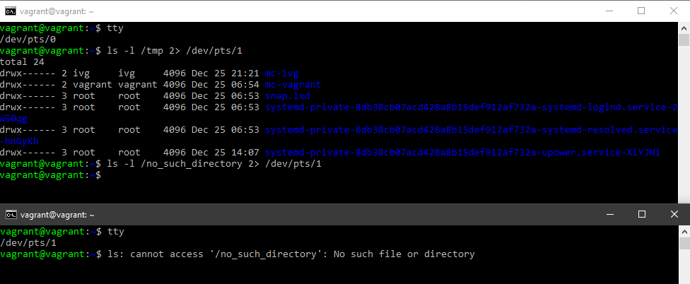
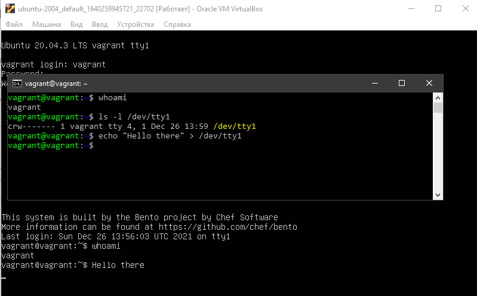

# Домашнее задание к занятию "3.2. Работа в терминале, лекция 2"

>1. Какого типа команда cd? Попробуйте объяснить, почему она именно
> такого типа; опишите ход своих мыслей, если считаете что она могла
> бы быть другого типа.
```
$ type cd
cd is a shell builtin
```

Команда `cd` - встроенная, потому что ей нужно модифицировать
окружение процесса, в котором она запущена, а именно, "сделать
указанный каталог отправной точкой для поиска путей для путей, не
начинающихся с '/'"
([POSIX](https://pubs.opengroup.org/onlinepubs/9699919799/utilities/cd.html)). Внешние
команды исполняются в своем окружении и не могут (в общем случае),
воздействовать на родительский процесс. Поэтому ей надо быть
встроенной, как [обнаружили еще Деннис Ричи с
коллегами](https://unix.stackexchange.com/questions/38808/why-is-cd-not-a-program):

> In the midst of our jubilation, it was discovered that the chdir
> (change current directory) command had stopped working. There was
> much reading of code and anxious introspection about how the
> addition of fork could have broken the chdir call. Finally the truth
> dawned: in the old system chdir was an ordinary command; it adjusted
> the current directory of the (unique) process attached to the
> terminal. Under the new system, the chdir command correctly changed
> the current directory of the process created to execute it, but this
> process promptly terminated and had no effect whatsoever on its
> parent shell! It was necessary to make chdir a special command,
> executed internally within the shell. It turns out that several
> command-like functions have the same property, for example login.

Однако во FreeBSD, OS X и некоторых других системах внешняя `cd` есть,
так как POSIX требует, чтобы эта команда, в числе других, была исполняемой:

> [C.1.7 Built-In Utilities](https://pubs.opengroup.org/onlinepubs/9699919799/xrat/V4_xcu_chap01.html#tag_23_01_07)
>
> All of these utilities can be exec-ed. 

```
$ uname -a
FreeBSD  12.3-RELEASE FreeBSD 12.3-RELEASE r371126 GENERIC  amd64
$ which cd
/usr/bin/cd
```

Впрочем, во FreeBSD она не делает ничего полезного, кроме возврата кода об
ошибке, если каталог не существует или недоступен. 

> 2. Какая альтернатива без pipe команде grep <some_string> <some_file> |
> wc -l?

`grep -c <some_string> <some_file>`

> 3. Какой процесс с PID 1 является родителем для всех процессов в вашей
> виртуальной машине Ubuntu 20.04?

```
   p pidlist
              Select by process ID.  Identical to -p and --pid.
```

Попробуем.

```
$ ps -p 1
    PID TTY          TIME CMD
      1 ?        00:00:02 systemd
$ ps p 1
    PID TTY      STAT   TIME COMMAND
      1 ?        Ss     0:02 /sbin/init
```

Ага, identical. init, хотя на самом деле это ссылка на systemd.

> 4. Как будет выглядеть команда, которая перенаправит вывод stderr ls
>    на другую сессию терминала?

`ls -l /tmp 2> /dev/pts/1`


> 5. Получится ли одновременно передать команде файл на stdin и
>    вывести ее stdout в другой файл? Приведите работающий пример.

```
$ grep find </dev/pts/1 > res.txt
find
sdfsafsd
sadfadsf
findfff
$ cat res.txt
find
findfff
```
В конце концов, `/dev/pts/1` - тоже файл.

> 6. Получится ли вывести находясь в графическом режиме данные из PTY
> в какой-либо из эмуляторов TTY? Сможете ли вы наблюдать выводимые
> данные?

Получится, если я имею права записи на этот tty.


> 7. Выполните команду bash 5>&1. К чему она приведет? Что будет, если
>    вы выполните echo netology > /proc/$$/fd/5? Почему так
>    происходит?

Команда приведет к запуску `bash`, у которой файловый дескриптор 5
будет перенаправлен в стандартный вывод (fd 1).

```
$ bash 5>&1
$ echo netology > /proc/$$/fd/5
netology
```

Вывод в файл с дескриптором 5 передается в файл с дескриптором 1
процесса с номером $$, то есть этого. К счастью, [ошибку с дескриптором 5](https://groups.google.com/g/gnu.bash.bug/c/E5Vdqv3tO1w?pli=1), наконец, починили.

> 8. Получится ли в качестве входного потока для pipe использовать
> только stderr команды, не потеряв при этом отображение stdout на
> pty?

Если нам важно сохранить именно pty:

```
$ exec 8>$(tty)
$ ls -A ~ /sdfsdf 2>&1 1>&8 | cat > errors.txt
/home/vagrant:
.bash_history  .bashrc  .config   errors.txt  .local    .python_history  .sudo_as_admin_successful  .wget-hsts
.bash_logout   .cache   .emacs.d  .lesshst    .profile  .ssh             .vbox_version
$ cat errors.txt
ls: cannot access '/sdfsdf': No such file or directory
$ exec 8>&-
```

Труба соединяет fd1 команды ls и fd0 команды cat, затем fd2 команды ls
направляется туда, куда указывает fd1 (то есть в трубу), а затем fd1
переключается туда, куда указывает fd8, который мы создали командой
exec (то есть на tty). В конце fd8 явно закрывается.

Вариант без exec и tty:

```
$ { ls -A ~ /sdfsdf 2>&1 1>&8 | cat > errors.txt; } 8>&1
/home/vagrant:
.bash_history  .bashrc  .config   errors.txt  .local    .python_history  .sudo_as_admin_successful  .wget-hsts
.bash_logout   .cache   .emacs.d  .lesshst    .profile  .ssh             .vbox_version
$ cat errors.txt
ls: cannot access '/sdfsdf': No such file or directory
```

Теперь fd8 создается неявно, для группы команд. Можно перенаправлять дальше: `{ { ls -A ~ /sdfsdf 2>&1 1>&8 | cat > errors.txt;  } 8>&1; } >ls.txt`


> 9. Что выведет команда cat /proc/$$/environ? Как еще можно получить
>    аналогичный по содержанию вывод?

Команда `cat /proc/$$/environ` выведет список переменных окружения,
которые были установлены при запуске текущего процесса (у нас
bash). Максимально близкий список можно получить командой `ps ep
$$`. Она тоже отобразит переменные, которые были установлены при
запуске, но не те, что установил (или модифицировал) сам bash в
процессе работы. Текущий список переменных можно получить командами `printenv`, `env`, 
или даже `$ for varname in $(compgen -e); do eval val=\$$varname; echo $varname=$val; done`

> 10. Используя man, опишите что доступно по адресам `/proc/<PID>/cmdline, /proc/<PID>/exe`

`/proc/[pid]/cmdline` : полная командная строка для процесса, если только процесс не является зомби.
			  
`/proc/[pid]/exe` : символическая ссылка, содержащая фактический путь
к выполненной команде. Открытие ее открывает исполняемый файл.

```			  
$ ls -l /proc/$$/exe
lrwxrwxrwx 1 vagrant vagrant 0 Dec 26 22:18 /proc/9434/exe -> /usr/bin/bash
```

> 11. Узнайте, какую наиболее старшую версию набора инструкций SSE
>     поддерживает ваш процессор с помощью /proc/cpuinfo

```
$ cat /proc/cpuinfo | grep flags
flags           : fpu vme de pse tsc msr pae mce cx8 apic sep mtrr pge mca cmov pat pse36 clflush mmx fxsr sse sse2 ht syscall nx mmxext fxsr_opt rdtscp lm 3dnowext 3dnow constant_tsc rep_good nopl nonstop_tsc cpuid extd_apicid tsc_known_freq pni cx16 x2apic popcnt hypervisor lahf_lm cmp_legacy cr8_legacy abm sse4a misalignsse 3dnowprefetch vmmcall
```

SSE3 (PNI).

> 12. При открытии нового окна терминала и vagrant ssh создается новая
>     сессия и выделяется pty. Это можно подтвердить командой tty,
>     которая упоминалась в лекции 3.2. Однако:
>
> `vagrant@netology1:~$ ssh localhost 'tty'`
>
> `not a tty`
>
> Почитайте, почему так происходит, и как изменить поведение

man ssh:

When the user's identity has been accepted by the server, the server
either executes the given command in a non-interactive session or, if
no command has been specified, logs into the machine and gives the
user a normal shell as an interactive session.

Так как указана команда, сессия будет неинтерактивной, без выделения pty.

 -t Force pseudo-terminal allocation.  This can be used to execute
 arbitrary screen-based programs on a remote machine, which can be
 very useful, e.g. when implementing menu services.

``` 
$ ssh -t localhost 'tty'
vagrant@localhost's password:
/dev/pts/2
Connection to localhost closed.
```

> Бывает, что есть необходимость переместить запущенный процесс из
> одной сессии в другую. Попробуйте сделать это, воспользовавшись
> reptyr. Например, так можно перенести в screen процесс, который вы
> запустили по ошибке в обычной SSH-сессии.

```
$ ps -ax | grep mc
  10203 pts/2    S+     0:00 screen mc
  10204 ?        Ss     0:00 SCREEN mc
  10205 pts/3    Ss+    0:00 mc
  10300 pts/0    S+     0:00 mcedit errors.txt
  10334 pts/5    S+     0:00 grep --color=auto mc
$ reptyr 10300
Unable to attach to pid 10300: Operation not permitted
The kernel denied permission while attaching. If your uid matches
the target's, check the value of /proc/sys/kernel/yama/ptrace_scope.
For more information, see /etc/sysctl.d/10-ptrace.conf
```

Ставим в `/etc/sysctl.d/10-ptrace.conf` `kernel.yama.ptrace_scope = 0`.
Получаем здесь mcedit, в другом терминале Stopped.

>14. sudo echo string > /root/new_file не даст выполнить
> перенаправление под обычным пользователем, так как перенаправлением
> занимается процесс shell'а, который запущен без sudo под вашим
> пользователем. Для решения данной проблемы можно использовать
> конструкцию echo string | sudo tee /root/new_file. Узнайте что
> делает команда tee и почему в отличие от sudo echo команда с sudo
> tee будет работать.

tee направляет поток данных на stdout и одновременно в указанные
файлы. Поскольку tee выполняется через sudo, он может записывать в
файл в каталоге /root. Можно также `sudo bash -c 'echo string | cat > /root/new_file'`

