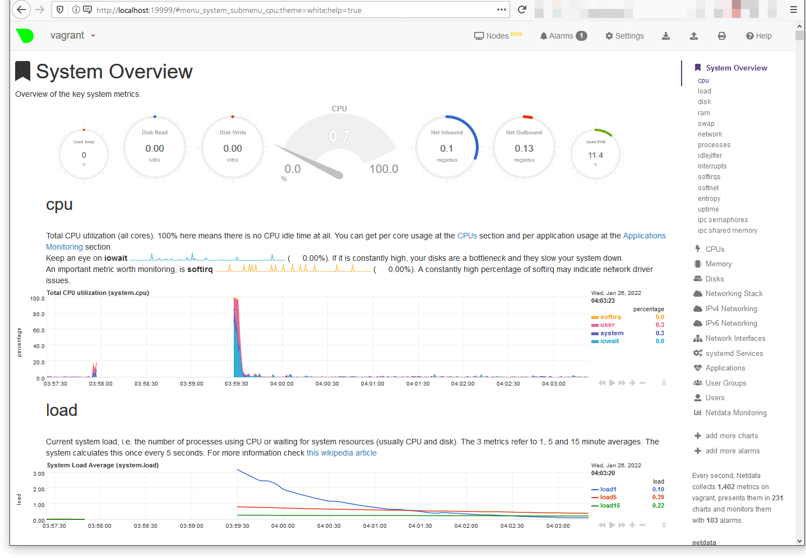

# Домашнее задание к занятию "3.4. Операционные системы, лекция 2"

> Используя знания из лекции по systemd, создайте самостоятельно
> простой unit-файл для node_exporter:

> - поместите его в автозагрузку, 
>
> - предусмотрите возможность добавления опций к запускаемому процессу
>      через внешний файл (посмотрите, например, на `systemctl cat
>      cron`),
>
> - удостоверьтесь, что с помощью systemctl процесс корректно
>      стартует, завершается, а после перезагрузки автоматически
>      поднимается.

Размещено под `/usr/local/`, так как устанавливалось, в соответствии с
заданием, мимо средств дистрибутива.

Простой `/etc/systemd/system/node_exporter.service` по образцу с
<https://github.com/prometheus/node_exporter/tree/master/examples/systemd>

```
sudo useradd --system --shell /sbin/nologin node_exporter
```

```
[Unit]
Description=Node Exporter

[Service]
User=node_exporter
EnvironmentFile=/usr/local/etc/node_exporter
ExecStart=/usr/local/bin/node_exporter $OPTIONS

[Install]
WantedBy=multi-user.target
```
Добавление опций через переменную `OPTIONS` в `/usr/local/etc/node_exporter`.
Проверка:

```
$ sudo systemctl daemon-reload
$ sudo systemctl enable node_exporter
Created symlink /etc/systemd/system/multi-user.target.wants/node_exporter.service → /etc/systemd/system/node_exporter.service.
$ sudo systemctl status node_exporter
● node_exporter.service - Node Exporter
     Loaded: loaded (/etc/systemd/system/node_exporter.service; enabled; vendor preset: enabled)
     Active: active (running) since Wed 2022-01-26 08:57:50 UTC; 9min ago
$ sudo systemctl stop node_exporter
$ sudo systemctl status node_exporter
● node_exporter.service - Node Exporter
     Loaded: loaded (/etc/systemd/system/node_exporter.service; enabled; vendor preset: enabled)
     Active: inactive (dead) since Wed 2022-01-26 09:08:35 UTC; 2s ago	
$ sudo systemctl restart node_exporter
$ sudo systemctl status node_exporter
● node_exporter.service - Node Exporter
     Loaded: loaded (/etc/systemd/system/node_exporter.service; enabled; vendor preset: enabled)
     Active: active (running) since Wed 2022-01-26 09:09:21 UTC; 4s ago
$ sudo reboot
(...)
$ sudo systemctl status node_exporter
● node_exporter.service - Node Exporter
     Loaded: loaded (/etc/systemd/system/node_exporter.service; enabled; vendor preset: enabled)
     Active: active (running) since Wed 2022-01-26 09:15:30 UTC; 29s ago
```

> Ознакомьтесь с опциями node_exporter и выводом /metrics
> по-умолчанию. 

```
$ curl -s http://localhost:9100/metrics | head
# HELP go_gc_duration_seconds A summary of the pause duration of garbage collection cycles.
# TYPE go_gc_duration_seconds summary
go_gc_duration_seconds{quantile="0"} 0.000138906
go_gc_duration_seconds{quantile="0.25"} 0.000389795
go_gc_duration_seconds{quantile="0.5"} 0.00088391
go_gc_duration_seconds{quantile="0.75"} 0.001382864
go_gc_duration_seconds{quantile="1"} 0.013262578
go_gc_duration_seconds_sum 0.060644475
go_gc_duration_seconds_count 38
# HELP go_goroutines Number of goroutines that currently exist.
```

> Приведите несколько опций, которые вы бы выбрали для базового
> мониторинга хоста по CPU, памяти, диску и сети.

Небольшой базовый набор может быть, например, таким.

Загрузка CPU (среднее за 5 мин):
`1 - avg by (instance)(irate(node_cpu_seconds_total{mode="idle"}[5m]))`

Память (доля занятой памяти):
`avg by (instance) (node_memory_MemAvailable_bytes / node_memory_MemTotal_bytes)`

Диск (заполнение диска):
`avg by (instance) (node_filesystem_avail_bytes / node_filesystem_size_bytes)`
Запись:
`sum by (instance) (irate(node_disk_written_bytes_total[2m]))`
Чтение:
`sum by (instance) (irate(node_disk_read_bytes_total[2m]))`

Сеть, чтение:
`sum by (instance) (irate(node_network_receive_bytes_total[2m]))`
Сеть, передача:
`sum by (instance) (irate(node_network_transmit_bytes_total[2m]))`
Сеть, ошибки чтения:
`sum by (instance) (rate(node_network_transmit_errs_total[2m]))`

> Установите в свою виртуальную машину Netdata.  ...  После успешной
> перезагрузки в браузере на своем ПК (не в виртуальной машине) вы
> должны суметь зайти на localhost:19999.




> Можно ли по выводу dmesg понять, осознает ли ОС, что загружена не на
> настоящем оборудовании, а на системе виртуализации?

Да, конечно.
```
$ dmesg | grep virt
[    0.026157] CPU MTRRs all blank - virtualized system.
[    0.159413] Booting paravirtualized kernel on KVM
[    0.371772] Performance Events: PMU not available due to virtualization, using software events only.
[    5.829694] systemd[1]: Detected virtualization oracle.
```

> Как настроен sysctl fs.nr_open на системе по-умолчанию? Узнайте, что
> означает этот параметр. Какой другой существующий лимит не позволит
> достичь такого числа (ulimit --help)?

```
$ sysctl fs.nr_open
fs.nr_open = 1048576
```
Это максимальное количество открытых файлов в одном процессе. Достичь
его в процессе пользователя не позволит лимит на максимальное количество дескрипторов открытых
файлов. 
```
$ ulimit -n
1024
```
Впрочем, его можно увеличить, как и `fs.nr_open`, теоретически, вплоть до `fs.file-max = 9223372036854775807`.

> Запустите любой долгоживущий процесс (не ls, который отработает
> мгновенно, а, например, sleep 1h) в отдельном неймспейсе процессов;
> покажите, что ваш процесс работает под PID 1 через nsenter. Для
> простоты работайте в данном задании под root (sudo -i). Под обычным
> пользователем требуются дополнительные опции (--map-root-user) и
> т.д.

В одном терминале:
```
$ sudo unshare -fp --mount-proc sleep 1h
```

В другом терминале:
```
$ ps -ef | grep sleep
root        4433    3842  0 20:01 pts/1    00:00:00 sudo unshare -fp --mount-proc sleep 1h
root        4434    4433  0 20:01 pts/1    00:00:00 unshare -fp --mount-proc sleep 1h
root        4435    4434  0 20:01 pts/1    00:00:00 sleep 1h
ivg         4464    3672  0 20:04 pts/0    00:00:00 grep --color=auto sleep
$ sudo nsenter -at 4435
root@vagrant:/# ps a
    PID TTY      STAT   TIME COMMAND
      1 pts/1    S+     0:00 sleep 1h
     15 pts/0    S      0:00 -bash
     26 pts/0    R+     0:00 ps a
```

> Найдите информацию о том, что такое :(){ :|:& };:. Запустите эту
> команду в своей виртуальной машине Vagrant с Ubuntu 20.04 (это
> важно, поведение в других ОС не проверялось). Некоторое время все
> будет "плохо", после чего (минуты) – ОС должна
> стабилизироваться. Вызов dmesg расскажет, какой механизм помог
> автоматической стабилизации. Как настроен этот механизм
> по-умолчанию, и как изменить число процессов, которое можно создать
> в сессии?

Это классическая [форк-бомба для
bash](http://mywiki.wooledge.org/BashFAQ/059).

Вызов dmesg дает:
```
[39303.002400] cgroup: fork rejected by pids controller in /user.slice/user-1001.slice/session-85.scope
```

Число форков процесса ограничивается механизмом Linux Control Groups
(cgroups). В Ubuntu этим механизмом занимается systemd. Лимит числа
процессов для данного пользователя можно узнать из файла:
```
$ cat /sys/fs/cgroup/pids/user.slice/user-$(id -u).slice/pids.max
5013
```
или

```
$ systemctl show user-$(id -u).slice | grep TasksMax
TasksMax=5013
```

Поменять лимит числа процессов для пользователя, зная его uid, можно так

```
$ sudo systemctl set-property user-1001.slice TasksMax=12
$ cat /sys/fs/cgroup/pids/user.slice/user-1001.slice/pids.max
12
```

Теперь форк-бомба отработает гораздо быстрее.

В рамках собственной сессии можно воспользоваться и механизмом `ulimit
-Su`.  Можно также настроить значение `nproc` для конкретного
пользователя в `/etc/security/limits.conf`, но это сработает только
при следующем логине. В любом случае механизмы будут работать
одновременно и применится более низкий лимит.


