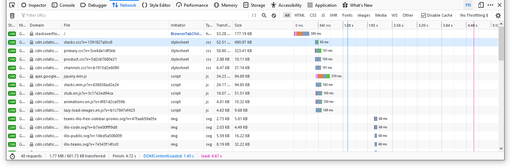

# Домашнее задание к занятию "3.6. Компьютерные сети, лекция 1"

> Подключитесь утилитой телнет к сайту stackoverflow.com `telnet
> stackoverflow.com 80` отправьте HTTP запрос
>
> ```
> GET /questions HTTP/1.0
> HOST: stackoverflow.com
> [press enter]
> [press enter]
> ```
> В ответе укажите полученный HTTP код, что он означает?

```
HTTP/1.1 301 Moved Permanently
cache-control: no-cache, no-store, must-revalidate
location: https://stackoverflow.com/questions
```

Код 301 означает, что ресурс был на постоянной основе перемещён в
новое месторасположение. В данном случае это означает, что
stackoverflow.com не работает по http, а только по https. Можно
использовать `openssl s_client -connect stackoverflow.com:443` и
получить `HTTP/1.1 200 OK` и всю страницу.

> Повторите задание 1 в браузере, используя консоль разработчика
> F12 <...> Укажите в ответе полученный HTTP код. Проверьте время загрузки
> страницы, какой запрос обрабатывался дольше всего?



Код 200 OK. Из запросов дольше всего обрабатывался запрос на загрузку
библиотеки jQuery. А если бы у меня была отключена блокировка рекламы
и трекинга, то появилась бы еще google-analytics.

> Какой IP адрес у вас в интернете?  Какому провайдеру принадлежит ваш
> IP адрес? 

`curl -s http://ipwhois.app/json/ | jq` (показана часть вывода):
``` json
{
  "ip": "130.162.37.18",
  "country": "Germany",
  "region": "Hessen",
  "city": "Frankfurt am Main",
  "asn": "AS43898",
  "org": "Oracle Public Cloud",
  "isp": "Oracle Svenska AB",
}
```

Это виртуальная машина в облаке Oracle с IP 130.162.37.18. Провайдером
ipwhois.app считает Oracle Svenska AB, но стандартного способа
определить точное название провайдера нет, и другие сервисы выдают
Oracle Public Cloud и т.д.

> Какой автономной системе AS? Воспользуйтесь утилитой whois

```
$ whois -h whois.radb.net 130.162.37.18
route:      130.162.0.0/16
descr:      Oracle via EMIX via EMIX
origin:     AS31898
notify:     noc@emix.net.ae
mnt-by:     MAINT-AS8966
changed:    noc@emix.net.ae 20200616
source:     RADB

route:      130.162.0.0/16
descr:      SP-ORACLE
origin:     AS19905
mnt-by:     MAINT-AS7786
changed:    wan.engineering@neustar.biz 20190731  #03:22:34Z
source:     RADB

route:      130.162.0.0/16
descr:      Oracle Cloud EM2
origin:     AS43898
member-of:  RS-ORACLE-CLOUD-43898
admin-c:    Network Contact Distribution
tech-c:     Dakota LaTurner
mnt-by:     MAINT-ORACLE
notify:     network-contact_ww@oracle.com
changed:    dakota.laturner@oracle.com 20190415  #18:31:16Z
source:     RADB

route:      130.162.0.0/16
descr:      Oracle Cloud EM2
origin:     AS7160
member-of:  RS-ORACLE-CLOUD-7160
admin-c:    Network Contact Distribution
mnt-by:     MAINT-ORACLE
changed:    apo.tartanoglu@oracle.com 20170424  #14:10:47Z
source:     RADB
```

> Через какие сети проходит пакет, отправленный с вашего компьютера на
> адрес 8.8.8.8? Через какие AS? Воспользуйтесь утилитой traceroute

```
$ traceroute -IAn 8.8.8.8
traceroute to 8.8.8.8 (8.8.8.8), 30 hops max, 60 byte packets
 1  140.91.198.43 [AS31898]  0.155 ms  0.126 ms  0.122 ms
 2  185.1.102.135 [*]  13.648 ms  13.645 ms  13.642 ms
 3  185.1.102.53 [*]  0.614 ms  0.607 ms  0.674 ms
 4  108.170.251.129 [AS15169]  0.672 ms  0.732 ms  0.730 ms
 5  142.250.46.249 [AS15169]  1.296 ms  1.294 ms  1.416 ms
 6  8.8.8.8 [AS15169]  0.535 ms  0.592 ms  0.570 ms
 ```
 
 1. Oracle Public Cloud, AS31898
 2. Equinix Internet Exchange Frankfurt
 3. Google, AS15169
 
> Повторите задание 5 в утилите mtr. На каком участке наибольшая
> задержка - delay?

```
                                 My traceroute  [v0.93]
instance-20220213-1201 (10.0.0.192)                            2022-02-13T14:23:15+0000
Keys:  Help   Display mode   Restart statistics   Order of fields   quit
                                               Packets               Pings
 Host                                        Loss%   Snt   Last   Avg  Best  Wrst StDev
 1. 140.91.198.73                             0.0%    27    0.2   0.2   0.1   1.1   0.2
 2. ipv4.de-cix.fra.de.as31898.oracle.com     0.0%    27    0.6   0.7   0.4   3.1   0.5
 3. ipv4.de-cix.fra.de.as15169.google.com     0.0%    27    1.4   3.4   0.8  17.2   4.2
 4. 108.170.252.1                             0.0%    26    2.2   2.0   1.6   3.5   0.4
 5. 142.250.214.197                           0.0%    26    0.8   0.8   0.7   0.8   0.0
 6. dns.google                                0.0%    26    0.8   0.8   0.7   0.8   0.0 
 
```

Маршрут через франкфуртские центры успел поменяться. Где-то внутри DE-CIX и задержка.

> Какие DNS сервера отвечают за доменное имя dns.google? Какие A
> записи? воспользуйтесь утилитой dig

(пропущена часть вывода):

```
$ dig +trace @77.88.8.8 dns.google

;; Received 525 bytes from 77.88.8.8#53(77.88.8.8) in 28 ms

;; Received 758 bytes from 192.36.148.17#53(i.root-servers.net) in 0 ms

;; Received 506 bytes from 216.239.36.105#53(ns-tld3.charlestonroadregistry.com) in 32 ms

dns.google.             900     IN      A       8.8.8.8
dns.google.             900     IN      A       8.8.4.4
dns.google.             900     IN      RRSIG   A 8 2 900 20220304151939 20220210151939 25800 dns.google. TJheVAazXDKbVM4jUmst+z1WIFqtd+/zMFPBQPoPAaTcP/zfB+Dx2Lkf J4aXl4uCnJiUUGlXwt6uGiyJf7TqBeF57fpJBex1tBDEk3QplSXVctEn A9CSWJmWEL46XaB+Iut1xjAarLV1+78UmeGG35FpNeheVtykk/4PRoGT A8Y=
;; Received 241 bytes from 216.239.32.114#53(ns1.zdns.google) in 4 ms
```

> Проверьте PTR записи для IP адресов из задания 7. Какое доменное имя
> привязано к IP? воспользуйтесь утилитой dig

```
$ dig -x 8.8.8.8

; <<>> DiG 9.16.1-Ubuntu <<>> -x 8.8.8.8
;; global options: +cmd
;; Got answer:
;; ->>HEADER<<- opcode: QUERY, status: NOERROR, id: 43140
;; flags: qr rd ra; QUERY: 1, ANSWER: 1, AUTHORITY: 0, ADDITIONAL: 1

;; OPT PSEUDOSECTION:
; EDNS: version: 0, flags:; udp: 65494
;; QUESTION SECTION:
;8.8.8.8.in-addr.arpa.          IN      PTR

;; ANSWER SECTION:
8.8.8.8.in-addr.arpa.   1882    IN      PTR     dns.google.

;; Query time: 0 msec
;; SERVER: 127.0.0.53#53(127.0.0.53)
;; WHEN: Sun Feb 13 15:25:53 UTC 2022
;; MSG SIZE  rcvd: 73
```
