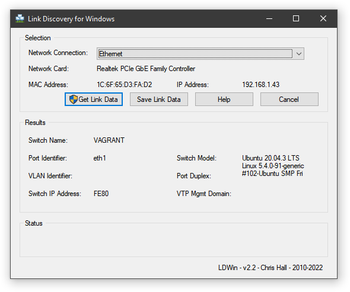

# Домашнее задание к занятию "3.7. Компьютерные сети, лекция 2"

> Проверьте список доступных сетевых интерфейсов на вашем
> компьютере. Какие команды есть для этого в Linux и в Windows?

Linux:
```
$ ip link
1: lo: <LOOPBACK,UP,LOWER_UP> mtu 65536 qdisc noqueue state UNKNOWN mode DEFAULT group default qlen 1000
    link/loopback 00:00:00:00:00:00 brd 00:00:00:00:00:00
2: eth0: <BROADCAST,MULTICAST,UP,LOWER_UP> mtu 1500 qdisc fq_codel state UP mode DEFAULT group default qlen 1000
    link/ether 08:00:27:b1:28:5d brd ff:ff:ff:ff:ff:ff
```
Windows:
```
$ ipconfig

Настройка протокола IP для Windows


Адаптер Ethernet Ethernet 3:

   DNS-суффикс подключения . . . . . :
   Локальный IPv6-адрес канала . . . : fe80::1892:4630:6232:26ca%6
   IPv4-адрес. . . . . . . . . . . . : 192.168.56.1
   Маска подсети . . . . . . . . . . : 255.255.255.0
   Основной шлюз. . . . . . . . . :

Адаптер Ethernet Ethernet 4:

   DNS-суффикс подключения . . . . . :
   Локальный IPv6-адрес канала . . . : fe80::7104:67ed:3186:a1f4%31
   Основной шлюз. . . . . . . . . :

Адаптер Ethernet Ethernet:

   DNS-суффикс подключения . . . . . :
   Локальный IPv6-адрес канала . . . : fe80::2d38:958f:2d94:fe0b%11
   IPv4-адрес. . . . . . . . . . . . : 192.168.1.43
   Маска подсети . . . . . . . . . . : 255.255.255.0
   Основной шлюз. . . . . . . . . : 192.168.1.1
```

Адаптер Ethernet Ethernet 3 - это виртуальный адаптер для VirtualBox,
Ethernet 4 - это loopback ("адаптер замыкания на себя").

> Какой протокол используется для распознавания соседа по сетевому
> интерфейсу? Какой пакет и команды есть в Linux для этого?

Например, LLDP - Link Layer Discovery Protocol. В ubuntu это пакет
lldpd.

В виртуальной машине он будет работать, если интерфейс
сконфигурировать в режиме моста, и если на хосте (у меня это Windows)
LLDP включен:

```
$ sudo lldpctl
-------------------------------------------------------------------------------
LLDP neighbors:
-------------------------------------------------------------------------------
Interface:    eth1, via: LLDP, RID: 1, Time: 0 day, 00:12:14
  Chassis:
    ChassisID:    mac 1c:6f:65:d3:fa:d2
  Port:
    PortID:       mac 1c:6f:65:d3:fa:d2
    TTL:          3601
    PMD autoneg:  supported: yes, enabled: yes
      Adv:          1000Base-T, HD: no, FD: yes
      MAU oper type: unknown
  LLDP-MED:
    Device Type:  Generic Endpoint (Class I)
    Capability:   Capabilities, yes
-------------------------------------------------------------------------------
```

Из Windows виртуальная машина тоже видна:



> Какая технология используется для разделения L2 коммутатора на
> несколько виртуальных сетей? Какой пакет и команды есть в Linux для
> этого? Приведите пример конфига.

Virtual Local Area Network, VLAN. На уровне ядра поддерживается
модулем 8021q, скрипты для конфигурации в ubuntu в пакете vlan. В 
файл `/etc/network/interfaces` записывается что-то вроде:

```
auto vlan10
iface vlan10 inet static
        address 10.0.0.1
        netmask 255.255.255.0
        vlan-raw-device eth0
```

Это создаст интерфейс `vlan10` на `eth0`. Однако в Ubuntu больше нет
`/etc/network/interfaces`. Чтобы он появился, нужно поставить пакет
ifupdown. Но настройка VLAN теперь выполняется с помошью `netplan`
примерно так (в файле `/etc/netplan/01-netcfg.yaml`):
```
vlans:
    vdev:
        id: 101
        link: net1
        addresses:
            - 10.0.1.10/24
```

> Какие типы агрегации интерфейсов есть в Linux? Какие опции есть для
> балансировки нагрузки? Приведите пример конфига.

В Linux в настоящее время поддерживается 7 типов агрегации (bonding)
сетевых карт: balance-rr, active-backup, balance-xor, broadcast,
802.3ad, balance-tlb, balance-alb. Типы с balance в названии
обеспечивают балансировку: по кругу, по MAC-адресам получателя и
отправителя.

```
/etc/netplan/01-netcfg.yaml

network:
    version: 2
    renderer: networkd
    ethernets:
      eth0:
        dhcp4: true
      eth1:
        dhcp4: true
      eth2:
        dhcp4: true
      eth3:
        dhcp4: true
    bonds:
      bond0:
       dhcp4: true
       interfaces: [eth1, eth2]
       parameters:
        mode: balance-tlb
```

> Сколько IP адресов в сети с маской /29 ? 

8, из которых узловых 6.

> Сколько /29 подсетей можно получить из сети с маской /24. 

`2^5=32`.

>  Приведите несколько примеров /29 подсетей внутри сети
>  10.10.10.0/24.

10.10.10.16/29, 10.10.10.32/29, 10.10.10.40/29 и т.д. до
10.10.10.248/29.

> Задача: вас попросили организовать стык между 2-мя
> организациями. Диапазоны 10.0.0.0/8, 172.16.0.0/12, 192.168.0.0/16
> уже заняты. Из какой подсети допустимо взять частные IP адреса?
> Маску выберите из расчета максимум 40-50 хостов внутри подсети.

В этом вопросе осталось непонятным, что значит "заняты". Настолько
заняты, что в них нельзя найти даже одну подсеть типа
`10.0.248.128/26` ?  Остается поискать среди других [Reserved
IP_addresses](https://en.wikipedia.org/wiki/Reserved_IP_addresses),
хотя это не рекомендуется. Предположим, `100.64.0.0/26`.

> Как проверить ARP таблицу в Linux, Windows? Как очистить ARP кеш
> полностью? Как из ARP таблицы удалить только один нужный IP?

Windows:
```
$ arp -a

Интерфейс: 192.168.56.1 --- 0x6
  адрес в Интернете      Физический адрес      Тип
  192.168.56.255        ff-ff-ff-ff-ff-ff     статический
  224.0.0.2             01-00-5e-00-00-02     статический
  224.0.0.22            01-00-5e-00-00-16     статический
  224.0.0.251           01-00-5e-00-00-fb     статический
  224.0.0.252           01-00-5e-00-00-fc     статический
  255.255.255.255       ff-ff-ff-ff-ff-ff     статический

Интерфейс: 192.168.1.43 --- 0xb
  адрес в Интернете      Физический адрес      Тип
  192.168.1.1           ec-43-f6-d5-63-b0     динамический
  192.168.1.36          00-0c-29-d4-79-75     динамический
  192.168.1.255         ff-ff-ff-ff-ff-ff     статический
  224.0.0.2             01-00-5e-00-00-02     статический
  224.0.0.22            01-00-5e-00-00-16     статический
  224.0.0.251           01-00-5e-00-00-fb     статический
  224.0.0.252           01-00-5e-00-00-fc     статический
  239.255.255.250       01-00-5e-7f-ff-fa     статический
  255.255.255.255       ff-ff-ff-ff-ff-ff     статический
```
(остальное пропущено)

Linux (в виртуальной машине):
```
$ arp -n
Address                  HWtype  HWaddress           Flags Mask            Iface
10.0.2.3                 ether   52:54:00:12:35:03   C                     eth0
10.0.4.2                 ether   52:54:00:12:35:02   C                     bond0
10.0.2.2                 ether   52:54:00:12:35:02   C                     eth0
```

Очистить ARP кэш в Windows (от администратора): `arp -d *` 

Очистить ARP кэш в Linux (наиболее надежный способ): `sudo ip link set
arp off dev eth0; sudo ip link set arp on dev eth0`

Удалить только один (не-)нужный IP inet_addr с интерфейса if_addr в
Windows: `arp -d -d inet_addr [if_addr]`

Удалить только один (не-)нужный IP с интерфейса В Linux: `arp -i eth0
-d 10.0.2.2`

