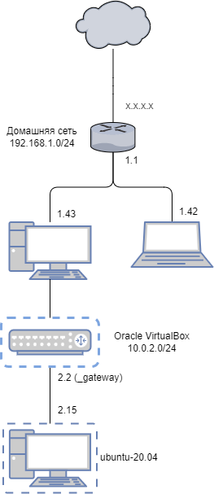

# Домашнее задание к занятию "3.8. Компьютерные сети, лекция 3"

> Подключитесь к публичному маршрутизатору в интернет. Найдите маршрут
> к вашему публичному IP

```
route-views>show ip route 130.162.37.18
Routing entry for 130.162.32.0/19
  Known via "bgp 6447", distance 20, metric 10
  Tag 3257, type external
  Last update from 89.149.178.10 5w1d ago
  Routing Descriptor Blocks:
  * 89.149.178.10, from 89.149.178.10, 5w1d ago
      Route metric is 10, traffic share count is 1
      AS Hops 2
      Route tag 3257
      MPLS label: none
```

> Создайте dummy0 интерфейс в Ubuntu. Добавьте несколько статических
> маршрутов. Проверьте таблицу маршрутизации.

netplan не поддерживает создание dummy-интерфейсов, поэтому делаем интерфейс через systemd.

```
$ cat /etc/systemd/network/dum0.netdev
[NetDev]
Name=dummy0
Kind=dummy
```

А остальное через netplan.
```
$ cat /etc/netplan/01-netcfg.yaml
network:
  version: 2
  ethernets:
    eth0:
      dhcp4: true
      routes:
        - to: default
          via: 10.0.2.2
    dummy0:
      addresses:
       - 10.0.2.17/24

$ ip route

default via 10.0.2.2 dev eth0 proto static onlink
default via 10.0.2.2 dev eth0 proto dhcp src 10.0.2.15 metric 100
10.0.2.0/24 dev eth0 proto kernel scope link src 10.0.2.15
10.0.2.2 dev eth0 proto dhcp scope link src 10.0.2.15 metric 100
192.168.33.0/24 dev eth1 proto kernel scope link src 192.168.33.10
```

Здесь сделан статический маршрут через 10.0.2.2, который и без того
устанавливается через dhcp, что не имеет особого смысла, но я что-то
не вижу, какой осмысленный статический маршрут можно придумать в
данной конфигурации.

> Проверьте открытые TCP порты в Ubuntu, какие протоколы и приложения
> используют эти порты? Приведите несколько примеров.

```
$ sudo ss -lt
State        Recv-Q       Send-Q               Local Address:Port                 Peer Address:Port       Process
LISTEN       0            128                        0.0.0.0:ssh                       0.0.0.0:*
LISTEN       0            4096                 127.0.0.53%lo:domain                    0.0.0.0:*
LISTEN       0            128                           [::]:ssh                          [::]:*
```

```
$ sudo nmap  127.0.0.1
Starting Nmap 7.80 ( https://nmap.org ) at 2022-02-27 08:36 UTC
Nmap scan report for localhost (127.0.0.1)
Host is up (0.000020s latency).
Not shown: 999 closed ports
PORT   STATE SERVICE
22/tcp open  ssh

Nmap done: 1 IP address (1 host up) scanned in 0.23 seconds
```

В этой виртуальной машине открыт только порт ssh (22). 127.0.0.53 - локальный DNS.

> Проверьте используемые UDP сокеты в Ubuntu, какие протоколы и
> приложения используют эти порты?

```
$ sudo ss -lun
State        Recv-Q        Send-Q                Local Address:Port               Peer Address:Port       Process
UNCONN       0             0                     127.0.0.53%lo:53                      0.0.0.0:*
UNCONN       0             0                    10.0.2.15%eth0:68                      0.0.0.0:*
```

Порт 53 (локальный DNS) и 68 для DHCP.

> Используя diagrams.net, создайте L3 диаграмму вашей домашней сети
> или любой другой сети, с которой вы работали.

На схеме показана также виртуальная машина с Ubuntu и VirtualBox,
выполняющий функцию коммутатора.




