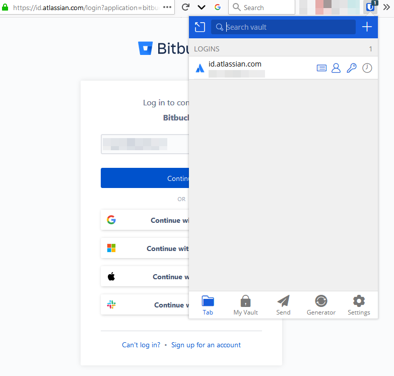
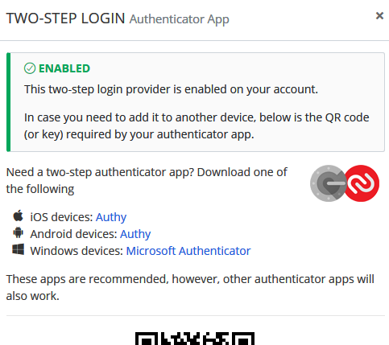
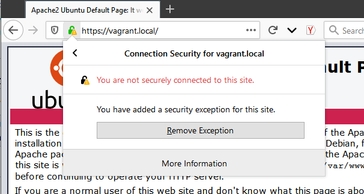
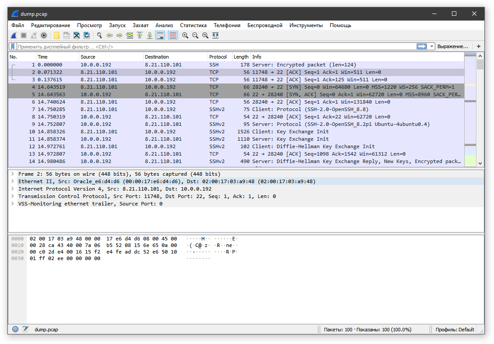

# Домашнее задание к занятию "3.9. Элементы безопасности информационных систем"

> Установите Bitwarden плагин для браузера. Зарегестрируйтесь и
> сохраните несколько паролей.

Вообще я пользуюсь другим менеджером паролей, поэтому установка только
для примера.



> Установите Google authenticator на мобильный телефон. Настройте вход
> в Bitwarden акаунт через Google authenticator OTP.



> Установите apache2, сгенерируйте самоподписанный сертификат,
> настройте тестовый сайт для работы по HTTPS.

Firefox не считает самоподписанные сертификат безопасными:



> Проверьте на TLS уязвимости произвольный сайт в интернете (кроме
> сайтов МВД, ФСБ, МинОбр, НацБанк, РосКосмос, РосАтом, РосНАНО и
> любых госкомпаний, объектов КИИ, ВПК ... и тому подобное).

```
$ ./testssl.sh netology.ru > testres.txt
```
Ничего фатального. Есть поддержка TLS 1 и TLS 1.1, а также уязвимости CVE-2016-2183, CVE-2016-6329 и
CVE-2011-3389, но это не очень страшные уязвимости, эксплуатировать их не очень просто. 

>Установите на Ubuntu ssh сервер, сгенерируйте новый приватный
>ключ. Скопируйте свой публичный ключ на другой сервер. Подключитесь к
>серверу по SSH-ключу.

```
$ ssh-copy-id -p 2222 ivg@127.0.0.1
/usr/bin/ssh-copy-id: INFO: Source of key(s) to be installed: "/c/Users/ivg/.ssh/id_rsa.pub"
/usr/bin/ssh-copy-id: INFO: attempting to log in with the new key(s), to filter out any that are already installed
/usr/bin/ssh-copy-id: INFO: 1 key(s) remain to be installed -- if you are prompted now it is to install the new keys
ivg@127.0.0.1's password:

Number of key(s) added: 1

Now try logging into the machine, with:   "ssh -p '2222' 'ivg@127.0.0.1'"
and check to make sure that only the key(s) you wanted were added.

$ ssh 'ssh://ivg@127.0.0.1:2222'
Welcome to Ubuntu 20.04.3 LTS (GNU/Linux 5.4.0-91-generic x86_64)
```

> Переименуйте файлы ключей из задания 5. Настройте файл конфигурации
> SSH клиента, так чтобы вход на удаленный сервер осуществлялся по
> имени сервера.

```
$ cat ~/.ssh/config
Host ubuntu
HostName vagrant.local
Port 2222
User ivg
IdentityFile ~/.ssh/id_rsa_ubuntu

$ ssh ubuntu
Welcome to Ubuntu 20.04.3 LTS (GNU/Linux 5.4.0-91-generic x86_64)
```

> Соберите дамп трафика утилитой tcpdump в формате pcap, 100
> пакетов. Откройте файл pcap в Wireshark.

`tcpdump -c 100 -w dump.pcap`



> Просканируйте хост scanme.nmap.org. Какие сервисы запущены?

```
$ nmap scanme.nmap.org
Starting Nmap 7.92 ( https://nmap.org ) at 2022-03-04 15:04 RTZ 6 (чшьр)
Nmap scan report for scanme.nmap.org (45.33.32.156)
Host is up (0.24s latency).
Other addresses for scanme.nmap.org (not scanned): 2600:3c01::f03c:91ff:fe18:bb2f
Not shown: 992 closed tcp ports (reset)
PORT      STATE    SERVICE
22/tcp    open     ssh
80/tcp    open     http
135/tcp   filtered msrpc
139/tcp   filtered netbios-ssn
445/tcp   filtered microsoft-ds
1900/tcp  filtered upnp
9929/tcp  open     nping-echo
31337/tcp open     Elite

Nmap done: 1 IP address (1 host up) scanned in 8.49 seconds
```
