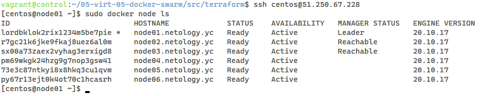
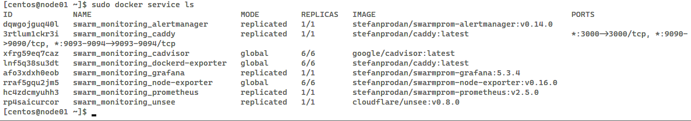

# Домашнее задание к занятию "5.5. Оркестрация кластером Docker контейнеров на примере Docker Swarm"

> Задача 1
>
> Дайте письменые ответы на следующие вопросы:
>
>     В чём отличие режимов работы сервисов в Docker Swarm кластере:
>     replication и global?

В режиме global на каждом узле работает один экземпляр сервиса. В
режиме replica количество реплик сервиса задается заранее, а
оркестратор запускает заданное количество на соответствующем
количестве узлов.

>     Какой алгоритм выбора лидера используется в Docker Swarm кластере?

Алгоритм выбора лидера в Docker Swarm является частью алгоритма
решения задач консенсуса Raft. Если обычный узел не получает сообщений
от лидера в течение определенного времени (election timeout), то он
делает себя кандидатом в лидеры на новый срок (term) и посылает другим
узлам запрос на голосование. Другие узлы голосуют за того кандидата,
от которого они получили первый запрос. Если кандидат получает
сообщение от лидера, то он снимает свою кандидатуру и возвращается в
обычное состояние. Если кандидат получает большинство голосов, то он
становится лидером. Если же он не получил большинства, то кандидат
ждёт случайное время и инициирует новую процедуру голосования.

Процедура голосования повторяется, пока не будет выбран лидер. 

>     Что такое Overlay Network?

"Оверлейная" сеть - это сеть, которая предназначена для связи между
несколькими демонами docker и сервисами сварма. При создании сварма на
каждом хосте Docker по умолчанию создается сеть `ingress`, через
которую сервисы связываются между собой.

> Задача 2
>
> Создать ваш первый Docker Swarm кластер в Яндекс.Облаке
>
> Для получения зачета, вам необходимо предоставить скриншот из терминала (консоли), с выводом команды:
>
> docker node ls

Отмечу, что скрипты для ansible в `05-virt-05-docker-swarm/` не
работают, так как в них используется ключ `package`, а теперь надо
`name` или `pkg`.

> Задача 3
>
> Создать ваш первый, готовый к боевой эксплуатации кластер мониторинга, состоящий из стека микросервисов.
>
> Для получения зачета, вам необходимо предоставить скриншот из терминала (консоли), с выводом команды:
>
> docker service ls

