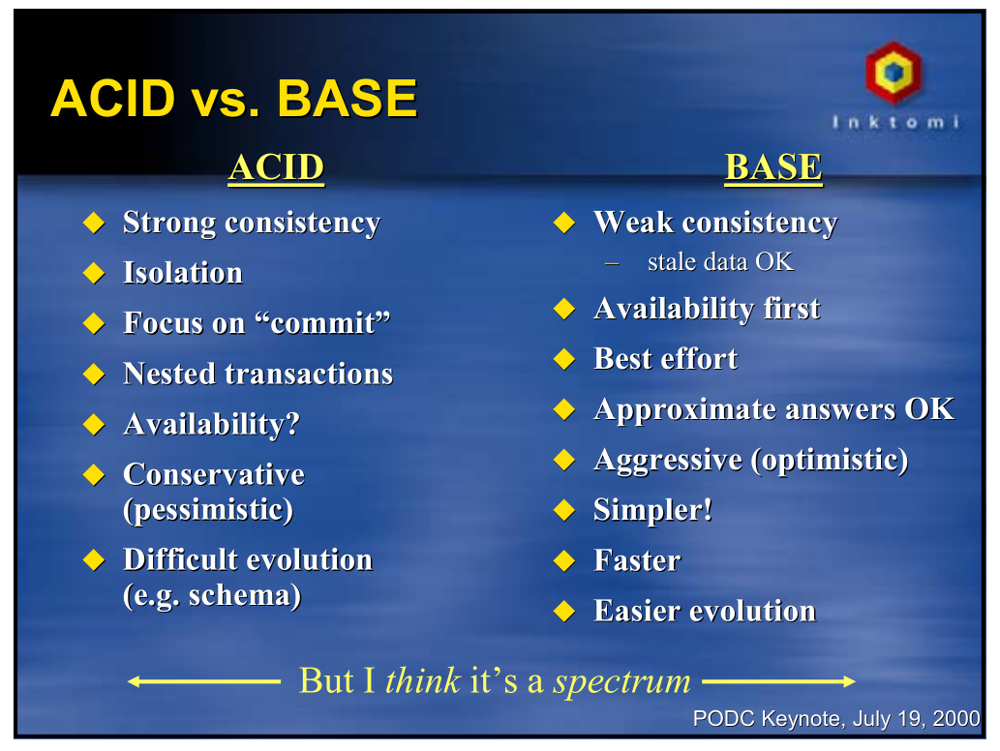

# Домашнее задание к занятию "6.1. Типы и структура СУБД"

> Задача 1
>
> Архитектор ПО решил проконсультироваться у вас, какой тип БД лучше
> выбрать для хранения определенных данных.
>
> Он вам предоставил следующие типы сущностей, которые нужно будет
> хранить в БД:
>
> Электронные чеки в json виде

Хранить электронные чеки в формате json странно. Чек имеет строго
определенный набор атрибутов (номер чека, код товара, ИНН, цена, номер
кассы и т.д.), и они обычно связаны с другими данными (БД товаров,
например). Хранить электронные чеки лучше в традиционной реляционной
БД, а формат json, если он нужен, несложно генерировать на лету.

> Склады и автомобильные дороги для логистической компании

Необходимость хранения данных о дорогах наводит на мысль об
использовании какой-то из СУБД с пространственными расширениями
(например, PostGIS). Дорожная сеть меняется медленно (если не считать
чрезвычайных ситуаций). В последнее время, однако, модными становятся
геопространственные базы на основе графовых СУБД - например, Neo4j.

> Генеалогические деревья

Генеалогические деревья, строго говоря, являются не деревьями, а
ориентированными ациклическими графами, поэтому строго иерархическая
база не подойдет. Графовые СУБД поддерживают такие графы. Однако
Ancestry.com все равно использует MySQL.

> Кэш идентификаторов клиентов с ограниченным временем жизни для
> движка аутенфикации

Ключ-значение. В Redis, например, есть время жизни ключей.

> Отношения клиент-покупка для интернет-магазина

Традиционная задача для реляционных СУБД по причине большой
взаимосвязанности данных.

> Задача 2
>
> Вы создали распределенное высоконагруженное приложение и хотите
> классифицировать его согласно CAP-теореме. Какой классификации по
> CAP-теореме соответствует ваша система, если (каждый пункт - это
> отдельная реализация вашей системы и для каждого пункта надо
> привести классификацию):
>
> Данные записываются на все узлы с задержкой до часа (асинхронная запись)

Отсутствие согласованности. (Ниоткуда не следует, конечно, что
остальные условия CAP-теоремы выполнены, так что сказать, что это
AP-система, нельзя).

> При сетевых сбоях, система может разделиться на 2 раздельных кластера

Если кластеры дают некорректный отклик, то это отсутствие устойчивости
к разделению. В противном случае все в порядке.

> Система может не прислать корректный ответ или сбросить соединение

Отсутствие доступности.

> А согласно PACELC-теореме, как бы вы классифицировали данные реализации?

Предполагая, что все прочие условия выполнены:

1. PA/EL
2. Не вполне ясно - система остается доступной, но
   несогласованной. Что происходит с латентностью, неясно.
3. PC/EC или PC/EL, описания недостаточно.
   
> Задача 3
>
> Могут ли в одной системе сочетаться принципы BASE и ACID? Почему?

Теоретически, эти принципы проектирования противоположны друг
другу. Но, как говорит автор CAP-теоремы Эрик Брюер, I think it's a
spectrum. 

> Задача 4
>
> Вам дали задачу написать системное решение, основой которого бы послужили:
>
> фиксация некоторых значений с временем жизни
> реакция на истечение таймаута
>
> Вы слышали о key-value хранилище, которое имеет механизм
> Pub/Sub. Что это за система? Какие минусы выбора данной системы?

Естественно, первое, что приходит на ум в качестве базы типа key-value
с временем жизни - Redis. Только вот есть проблема - реакции на
истечение таймаута в нем нет. Событие `expired` будет сгенерировано,
только когда кто-нибудь (в том числе внутренний процесс сервера)
обратится к ключу, время жизни которого истекло. Так что если нам
нужна реакция на истечение таймаута, а не на удаление ключа, придется
использовать что-то другое. Что именно - это вопрос, так как все
ведущие базы типа key-value используют lazy механизмы.
