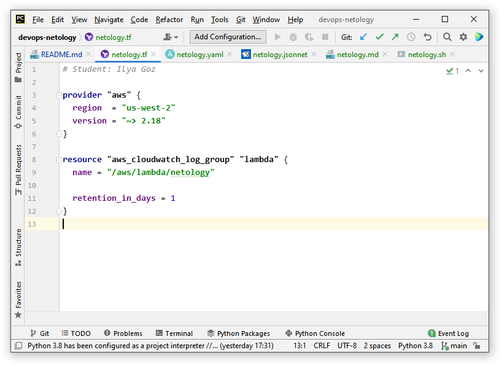
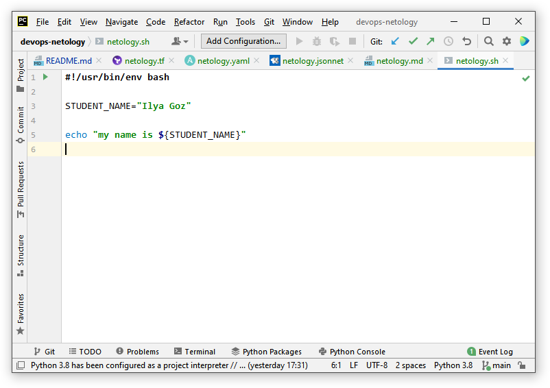
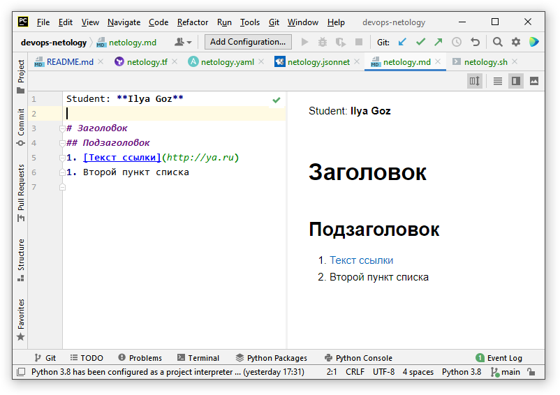
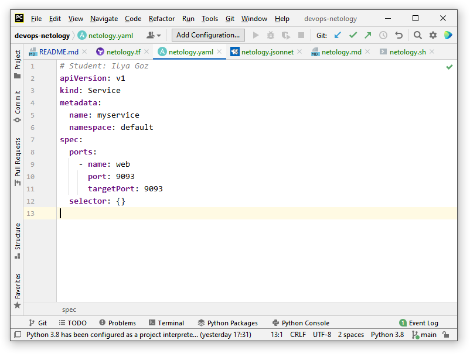
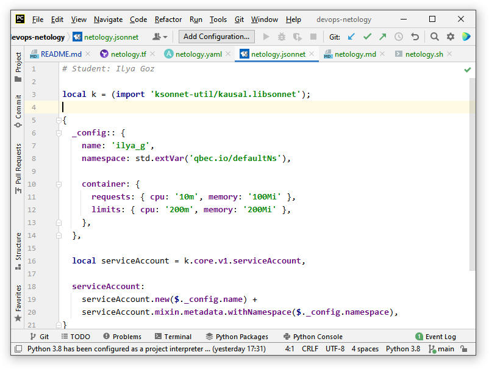

## Задание №1 - Подготовка рабочей среды

- Terraform:

- Bash:
 
- Markdown:

- Yaml:

- Jsonnet:
 
 
## Задание №2 - Описание жизненного цикла задачи (разработки нового функционала)
> Чтобы лучше понимать предназначение дальнейших инструментов, с которыми нам предстоит работать, давайте составим схему жизненного цикла задачи в идеальном для вас случае.
> #### Описание истории
> Представьте, что вы работаете в стартапе, который запустил интернет-магазин. Ваш интернет-магазин достаточно успешно развивался, и вот пришло время налаживать процессы: у вас стало больше конечных клиентов, менеджеров и разработчиков.Сейчас от клиентов вам приходят задачи, связанные с разработкой нового функционала. Задач много, и все они требуют выкладки на тестовые среды, одобрения тестировщика, проверки менеджером перед показом клиенту. В случае необходимости, вам будет необходим откат изменений.
> #### Решение задачи
> Вам необходимо описать процесс решения задачи в соответствии с жизненным циклом разработки программного обеспечения. Использование какого-либо конкретного метода разработки не обязательно. Для решения главное - прописать по пунктам шаги решения задачи (релизации в конечный результат) с участием менеджера, разработчика (или команды разработчиков), тестировщика (или команды тестировщиков) и себя как DevOps-инженера.

Прежде всего предположим, что в стартапе уже в том или ином виде внедрен сам процесс разработки программного обеспечения 
на основе DevOps, и поэтому задача DevOps-инженера состоит не в первоначальной настройке процессов, 
выборе и установке программных средств для организации этих процессов и т.д., а в их поддержке,
масштабировании и непрерывном совершенствовании.

Как известно, в современных моделях разработки ПО вместо длинной последовательности (постановка задачи, 
проектирование, разработка, тестирование и пр.) используются короткие итерации, в которых, однако, 
содержатся те же этапы. На каждом из них применяется соответствующий инструментарий, и задача 
DevOps-инженера в первую очередь заключается в поддержании и, насколько возможно, оптимизации и 
автоматизации работы этого инструментария. 

Начнем с поступления задач. Клиенты могут связываться с командой разработки/эксплуатации по разным
каналам, от телефона и электронной почты до социальных сетей. Запросы должны попадать к соответствующим
сотрудникам, регистрироваться и систематизироваться, для чего существуют свои инструменты, поддержанием
которых занимается DevOps-инженер.

По мере поступления запросов формулируются и отбираются задачи для реализации на очередной итерации.
Они регистрируются в инструменте управления проектом, поддержанием которого занимается DevOps-инженер.

Далее разработчики занимаются реализацией функций, тогда как DevOps-инженер - обеспечением 
функционирования и единообразия сред разработки, репозитория кода, средств оценки качества кода,
рабочего взаимодействия разработчиков, средств проверки безопасности кода, наконец, 
автоматической сборки проекта и последующего тестирования.  

После успешной сборки проекта с реализованными функциями он должен выкладываться в тестовую среду 
и проходить тестирование. Соответственно, DevOps-инженер поддерживает инструменты и по возможности
автоматизирует процесс выкладки, тестирования и сбора результатов, следя за единообразием тестовых
сред. По окончании тестирования проект передается в демонстрационную среду, и после проверки 
менеджером и показа клиенту - в производственную, где начинается часть Ops работы DevOps-инженера.

DevOps-инженер занимается развертыванием в производственной среде, выделением облачных ресурсов
и т.д., при необходимости осуществляет откатку, а в дальнейшем - сбор информации о работе проекта 
в производственной среде, ошибках и прочих проблемах. Эти проблемы, в свою очередь, регистрируются и систематизируются, становясь задачами
для одной из следующих итераций.

