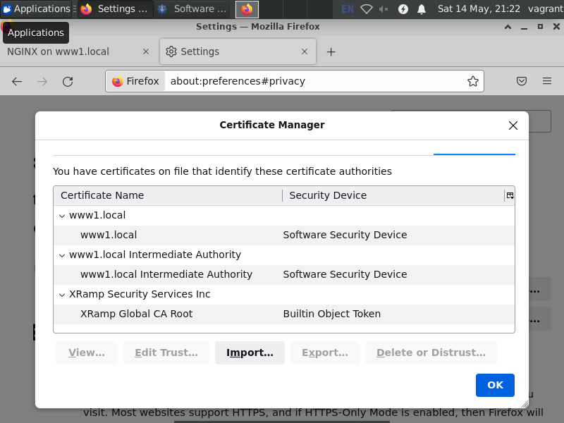
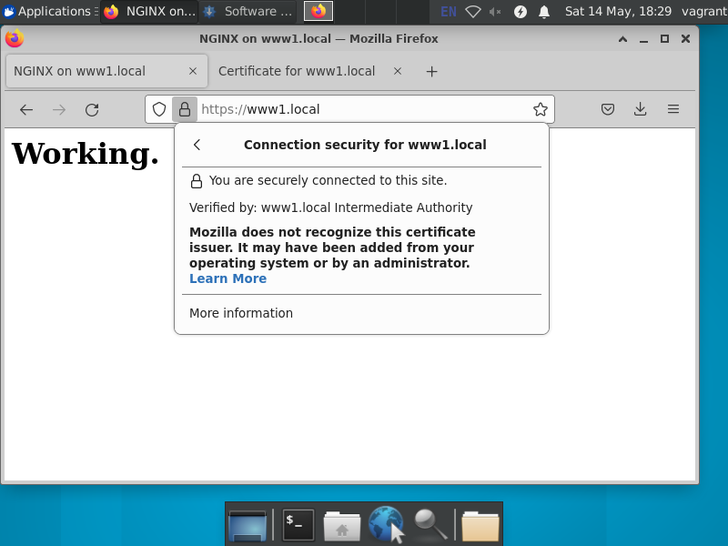

# Курсовая работа по итогам модуля "DevOps и системное администрирование"

> Создайте виртуальную машину Linux.

Использовались две виртуальные машины: отдельно для Hashicorp Vault
(vaultserver) и для Nginx (webserver). C третьей машины велась
настройка через Ansible. Сеть настроена так:

```
192.168.56.8 vault.local
192.168.56.9 www1.local
192.168.56.4 control.local
```
`ansible-playbook -i ./inventory update-hosts.yml`

> Установите ufw и разрешите к этой машине сессии на порты 22 и 443,
> при этом трафик на интерфейсе localhost (lo) должен ходить свободно
> на все порты.

Настройка ufw на веб-сервере: 

`ansible-playbook -i ./inventory configure_ufw.yml`

```
vagrant@www1:~$ sudo ufw status
Status: active

To                         Action      From
--                         ------      ----
22/tcp                     ALLOW       Anywhere
443                        ALLOW       Anywhere
Anywhere on lo             ALLOW       Anywhere
22/tcp (v6)                ALLOW       Anywhere (v6)
443 (v6)                   ALLOW       Anywhere (v6)
Anywhere (v6) on lo        ALLOW       Anywhere (v6)
```

> Установите hashicorp vault

`ansible-playbook -i ./inventory install_vault.yml`

Сложная часть. Во-первых, установка из репозитория Hashicorp не
работает без VPN. Во избежание излишней нагрузки пакет
`vault_1.10.2-1_amd64.deb` просто кладется в каталог с
`install_vault.yml`. Скрипт устанавливает пакет на vaultserver
(vault.local) и конфигурирует его для использования tls, генерируя
сертификаты с помощью `openssl`. Затем сертификаты рассылаются по всем
машинам, помеченным в `inventory` как `vaultusers` и устанавливаются
там с помощью `update-ca-certificates`. Отдельно запускается
`ansible-playbook -i ./inventory set_vault_addr.yml` для установки на
них же переменной `VAULT_ADDR`.

Инициализация и unsealing с помощью ключей делаются вручную.

```
$ vault operator init
$ vault operator unseal
$ vault login
...
$ vault status
Key             Value
---             -----
Seal Type       shamir
Initialized     true
Sealed          false
Total Shares    5
Threshold       3
Version         1.10.2
Storage Type    file
Cluster Name    vault-cluster-7d59b469
Cluster ID      81b08a8b-a462-7d5f-85bb-39bd9e309a3f
HA Enabled      false
```

> Cоздайте центр сертификации по инструкции (ссылка) и выпустите
> сертификат для использования его в настройке веб-сервера nginx (срок
> жизни сертификата - месяц).

Для последующего обновления сертификатов настраивается также
аутентификация через AppRole. Выполняется на административной машине.

```
$ vault secrets enable pki
Success! Enabled the pki secrets engine at: pki/

$ vault secrets tune -max-lease-ttl=87600h pki
Success! Tuned the secrets engine at: pki/

$ vault auth enable approle
Success! Enabled approle auth method at: approle/

$ vault policy write webserver -<<EOF
> path "pki*" {
  capabilities = [ "create", "read", "update", "delete", "list", "sudo" ]
}
> EOF
Success! Uploaded policy: webserver

$ vault write auth/approle/role/webserver token_policies="webserver"
Success! Data written to: auth/approle/role/webserver

$ vault read auth/approle/role/webserver/role-id
Key        Value
---        -----
role_id    ...

$ vault write -force auth/approle/role/webserver/secret-id
Key                   Value
---                   -----
secret_id             ...
secret_id_accessor    ...
secret_id_ttl         0s
```

Генерация корневого сертификата.

```
$ vault write -field=certificate pki/root/generate/internal \
     common_name="www1.local" \
     ttl=87600h > CA_cert.crt	 
$ vault write pki/config/urls \
     issuing_certificates="$VAULT_ADDR/v1/pki/ca" \
     crl_distribution_points="$VAULT_ADDR/v1/pki/crl"
Success! Data written to: pki/config/urls
```

Генерация промежуточного центра сертификации и запроса на подписание
сертификата корневым центром.

```
$ vault secrets enable -path=pki_int pki
Success! Enabled the pki secrets engine at: pki_int/

$ vault secrets tune -max-lease-ttl=43800h pki_int
Success! Tuned the secrets engine at: pki_int/

$ vault write -format=json pki_int/intermediate/generate/internal \
     common_name="www1.local Intermediate Authority" \
     | jq -r '.data.csr' > pki_intermediate.csr	 

$ ls -l pki_intermediate.csr
-rw-rw-r-- 1 vagrant vagrant 924 May 14 13:20 pki_intermediate.csr
```

Подписание сертификата корневым центром и импорт подписанного сертификата.

```
$ vault write pki/root/sign-intermediate csr=@pki_intermediate.csr \
     format=pem_bundle ttl="43800h" > intermediate.cert.pem

$ ls -l intermediate.cert.pem
-rw-rw-r-- 1 vagrant vagrant 2683 May 14 18:14 intermediate.cert.pem	 

$ vault write pki_int/intermediate/set-signed certificate=@intermediate.cert.pem
Success! Data written to: pki_int/intermediate/set-signed
```

Создание роли для запросов сертификатов с веб-сервера.

```
$ vault write pki_int/roles/webserver \
     allowed_domains="local" \
     allow_subdomains=true \
     max_ttl="720h"

Success! Data written to: pki_int/roles/webserver
```

Теперь настройка на веб-сервере. Создается файл `payload.json` с паролем для доступа к vault.

```
$ cat payload.json
{
 "role_id": ... ,
 "secret_id": ...
}
$ ls -l payload.json
-r-------- 1 vagrant vagrant 109 May 14 11:40 payload.json
```

Скрипт `refresh_cert.sh`  для получения сертификата и установки его в Nginx:

``` shell
#!/bin/bash
set -e

APP_TOKEN=$(curl --request POST --data @payload.json $VAULT_ADDR/v1/auth/approle/login | jq -r .auth.client_token)
curl --header "X-Vault-Token: $APP_TOKEN" --request POST --data \
     '{"common_name": "www1.local", "ttl": "24h", "format": "pem_bundle"}' \
     $VAULT_ADDR/v1/pki_int/issue/webserver | jq > cert.json

jq -r .data.certificate < cert.json > $(hostname -f).crt
jq -r .data.private_key < cert.json > $(hostname -f).key
sudo cp $(hostname -f).crt /etc/ssl/certs/
sudo cp $(hostname -f).key /etc/ssl/private/

sudo systemctl restart nginx
echo Certificates refreshed at $(date) > last_refresh
```

> Установите корневой сертификат созданного центра сертификации в
> доверенные в хостовой системе.

Причем в несколько мест. Например, Mozilla не использует системный
набор.



> Установите nginx.

Установка в стандартной конфигурации с помощью официальной роли Ansible.

`ansible-playbook -i ./inventory install_nginx.yml`

Также устанавливается `jq`, который понадобится для генерации запросов.

``` yaml
---
- hosts: webservers
  become: true
  roles:
    - role: nginxinc.nginx
      vars:
         nginx_install_from: nginx_repository
         nginx_state: install
         nginx_setup: install
  tasks:
  - name: Installing jq
    apt:
      name: jq
      state: present
 ```

Настройка nginx для работы с TLS, установка скрипта для запроса и
установки сертификатов, настройка `cron` для запроса сертификата
каждые 20 ч., так как сертификат выдается на 24 ч.

`ansible-playbook -i ./inventory configure_nginx_tls.yaml`

``` yaml
- name: Configuring TLS in nginx
  hosts: webservers
  become: true
  tasks:
  - name: Copying server_with_tls.conf
    template:
     src: ./server_with_tls.conf.j2
     dest: /etc/nginx/conf.d/server_with_tls.conf
  - name: Copying script for refreshing certificates
    copy:
     src:  ./refresh_cert.sh
     dest: ./refresh_cert.sh
     mode: u+x
  - name: Refreshing certificates
    ansible.builtin.shell: ./refresh_cert.sh

  - name: Setting up cron for refreshing certificates
    ansible.builtin.cron:
     name: "Refresh certificates"
     user: vagrant
     minute: "1"
     hour: "*/20"
     job: "/home/vagrant/refresh_cert.sh"
```

Обновление работает:

```
$ cat last_refresh
Certificates refreshed at Sat May 14 09:19:25 PM UTC 2022
```

Страница в браузере видна:



